# ACDS_DependencyGraph.md - 積木依賴圖

**專案名稱**：Excel 驅動型圖片兩階段批次浮水印處理系統（純模組化強固版）
**對應原始碼版本**：V17（2026-09 系列，見 ADR-017、ADR-018）
**核對方法**：直接讀取各模組原始碼中的實際 `Call`／函式呼叫，非規劃推測。取代先前 `合約與依賴關係圖.txt`（v1.1.0）與 `拓樸_思考型.txt`（v2.0.0）中的依賴圖——兩者皆含未落地的規劃內容（例如 `Mod_Speaker`、`outExportDir` 等已不存在的元素），本文件以實作為準。V13 相較 V12 新增之 `PurgeBlankOrphanSheets`（見 ADR-013）歸屬既有 `Mod_InteractionAdapter` 節點內，未產生新的模組依賴邊。**V17（ADR-017、ADR-018）於 `Mod_FileSystem`／`Mod_InteractionAdapter` 內部函式異動，皆未新增或移除任何模組間依賴邊，下方拓撲圖結構不變，函式簽章詳見 `ACDS_ContractRegistry.md`。**

本系統死守單向、線性流向拓撲，嚴禁循環依賴。

## 一、模組依賴關係圖（Mermaid 拓撲，五層）

```mermaid
graph TD
    %% ==========================================
    %% LEVEL 0：按鈕接收層（唯一暴露於 Excel 巨集清單）
    %% ==========================================
    Mod_MainCoordinator --> Mod_WorkflowManager

    %% ==========================================
    %% LEVEL 1：流程大腦層（唯一持有跨模組調度順序知識）
    %% ==========================================
    Mod_WorkflowManager --> cls_DAGEngine
    Mod_WorkflowManager --> cls_Settings
    Mod_WorkflowManager --> Mod_InteractionAdapter
    Mod_WorkflowManager --> Mod_SheetSchemaBuilder
    Mod_WorkflowManager --> Mod_UIRenderer
    Mod_WorkflowManager --> Mod_FileSystem
    Mod_WorkflowManager --> Mod_ImportPipeline
    Mod_WorkflowManager --> Mod_ExportPipeline
    Mod_WorkflowManager --> Mod_LogManager
    Mod_WorkflowManager --> View_CanvasManager
    Mod_WorkflowManager --> Mod_UI_Messenger
    Mod_WorkflowManager --> Mod_StringConstants

    %% ==========================================
    %% LEVEL 2：批次管線層（對 Excel 網格 100% 無知或近乎無知）
    %% ==========================================
    Mod_ImportPipeline --> Mod_FileSystem
    Mod_ImportPipeline --> Mod_Crypto
    Mod_ImportPipeline --> Mod_UI_Messenger
    Mod_ImportPipeline --> Mod_InteractionAdapter
    Mod_ImportPipeline --> cls_ImportResult
    Mod_ImportPipeline --> Mod_StringConstants

    Mod_ExportPipeline --> Mod_ImageWatermark
    Mod_ExportPipeline --> Mod_InteractionAdapter
    Mod_ExportPipeline --> Mod_LogManager
    Mod_ExportPipeline --> Mod_UI_Messenger
    Mod_ExportPipeline --> Mod_StringConstants

    %% ==========================================
    %% LEVEL 3：專業算力引擎層（單一職責，互相水平隔離）
    %% ==========================================
    Mod_FileSystem --> cls_Settings
    Mod_FileSystem --> Mod_StringConstants

    Mod_Crypto --> Mod_StringConstants

    Mod_ImageWatermark --> cls_ImageEntity
    Mod_ImageWatermark --> cls_Settings
    Mod_ImageWatermark --> Mod_StringConstants

    Mod_InteractionAdapter --> cls_ImageEntity
    Mod_InteractionAdapter --> cls_ImportResult
    Mod_InteractionAdapter --> Mod_StringConstants

    Mod_SheetSchemaBuilder --> Mod_StringConstants

    Mod_UIRenderer --> Mod_UI_Messenger
    Mod_UIRenderer --> Mod_StringConstants

    Mod_LogManager --> Mod_UI_Messenger
    Mod_LogManager --> Mod_StringConstants

    View_CanvasManager --> Mod_StringConstants

    cls_DAGEngine --> cls_EventStore
    cls_DAGEngine --> Mod_StringConstants

    %% ==========================================
    %% LEVEL 4：基礎事實層（SSOT，不依賴任何模組）
    %% ==========================================
    Mod_StringConstants
    cls_Settings --> Mod_StringConstants
    cls_ImageEntity --> Mod_StringConstants
    cls_ImportResult
    cls_EventStore

```

> `ICommand` 節點已於 V13 隨模組撤除移除（見 ADR-009），不再出現於本拓撲圖。

## 二、拓撲規則防禦紅線（Forbidden Rules，V13 實作已驗證落實）

1. **按鈕層零邏輯紅線**：`Mod_MainCoordinator` 五個巨集入口，每個都只有一行 `Call Mod_WorkflowManager.RunXxx`，不含任何 If/迴圈/網格讀寫。已於原始碼逐一核對成立。
2. **管線對網格無知紅線**：`Mod_ExportPipeline`／`Mod_ImportPipeline` 內部完全不出現 `Cells(...)`／`Range(...)`，只操作 `Collection` 與 `cls_ImageEntity`／`cls_ImportResult` 物件；日誌寫入、存檔動作與 Staging 讀寫全部委託給 `Mod_InteractionAdapter`（V13 起兩支管線對稱達成，見 ADR-016）。
3. **黑幕主權集中紅線**：`Application.ScreenUpdating`／`Application.Calculation` 的開關動作，只允許出現在 `Mod_WorkflowManager`（透過委派 `Mod_InteractionAdapter.TogglePerformanceMode`）與少數幾個明確自我管理進出場的模組（`Mod_UIRenderer`、`Mod_LogManager.ConsolidateAllLogs`）；`Mod_ImageWatermark`、`Mod_ExportPipeline`、`Mod_FileSystem` 等下層引擎的 Manifest 明文禁止私自調用。詳見 ADR-005。
4. **CreateObject 收攏紅線**：`Mod_FileSystem`／`Mod_Crypto`／`Mod_ImageWatermark`／`Mod_ImportPipeline` 內部不私自 `CreateObject` 取得 FSO/Stream/MD5，一律透過 `Mod_WorkflowManager` 建立並注入的 `sysTokens` 字典取用（例外：`Mod_ImageWatermark.HandleWiaResizing` 因 WIA 元件生命週期需求，允許自行 `CreateObject(PROGID_WIA_IMAGE/PROGID_WIA_PROCESS)`，這兩個 ProgID 未納入 sysTokens）。
5. **常數唯一性紅線**：除 `Mod_StringConstants` 外，其餘模組內部不得寫入任何硬編碼的工作表名稱、欄位字串、資料夾前綴。已於 V12 原始碼核對，未發現殘留硬編碼（V0 時期 `Mod_ActionExecutor.InitializeStagingSheet` 的硬編碼表頭文字問題，已隨該模組於 V8 一併拆除）。

## 三、已知的拓撲不完美之處（誠實揭露，非隱藏債務）

- `cls_DAGEngine`／`cls_EventStore` 之間的依賴，以及兩者對 `Mod_StringConstants` 的依賴程度很低（幾乎不使用常數，多為程式內建字串），與圖上標示的依賴強度不完全對稱，但仍屬合規的單向依賴，不影響拓撲鐵律。

> **異動記錄**：原本記載於此的「`Mod_ImportPipeline` 仍直接持有 `wsStaging`」技術債，已於 ADR-016 修復——新增 `cls_ImportResult` 類別與 `Mod_InteractionAdapter.LoadExistingHashSet`／`WriteImportResults` 兩支函式，`Mod_ImportPipeline` 現與 `Mod_ExportPipeline` 對稱達成對 Excel 網格 100% 無知，見下方拓撲圖第 19 支模組。
>
> **異動記錄（V17，ADR-017、ADR-018）**：`Mod_FileSystem`、`Mod_InteractionAdapter`
> 內部函式全面異動（固定拓撲存取、事件式整批備份、帳本硬碟一致性防呆），完整函式
> 清單見 `ACDS_ContractRegistry.md`。`Mod_WorkflowManager --> Mod_FileSystem`、
> `Mod_WorkflowManager --> Mod_InteractionAdapter` 這兩條既有依賴邊本身不變。
